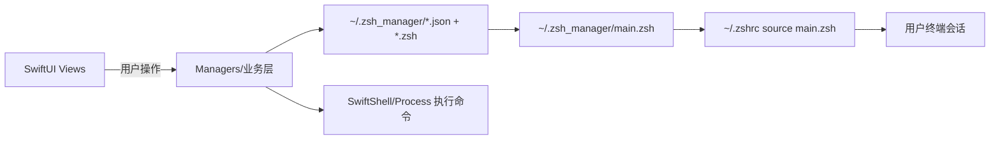

# 架构与关键流程

## 1. 项目概览

- 工程形态：macOS SwiftUI App（SPM `executableTarget`），最低支持 macOS 12。
- 核心哲学：Shadow Management（影子接管），避免“全量解析 `.zshrc`”的脆弱性，改用“注入加载器 + 分模块落盘”的方式隔离管理。
- UI 结构：单窗口 Sidebar 导航，多功能页面（Aliases / PATH / Environments / Doctor / Snapshots / Plugins / Terminal Master 等）。

仓库中对产品边界的描述见 [AGENT.md](../../AGENT.md)。

## 2. 架构与关键流程

### 2.1 分层与职责

- UI 层：`Sources/ZshrcManager/Views/*` 负责展示与交互。
- 业务层（Managers）：`Sources/ZshrcManager/*Manager.swift` 负责状态、落盘、执行命令与业务编排。
- 基础设施：
  - Shell 执行：通过 SwiftShell（同步/异步）。
  - 文件系统：`FileManager` 为主，落盘至 `~/.zsh_manager`。

### 2.2 Shadow Management（影子接管）机制

核心约束：只要能保证终端启动时加载 `~/.zsh_manager/main.zsh`，就能在不破坏原配置的情况下，通过模块化文件覆盖/追加能力。

#### 2.2.1 接管时写入的内容

接管由 `ShellManager.install()` 完成（见 [ShellManager.swift](../../Sources/ZshrcManager/ShellManager.swift)）：

- 若 `~/.zsh_manager/main.zsh` 不存在：创建 loader 文件，默认按顺序加载：
  - `aliases.zsh`
  - `env.zsh`
  - `paths.zsh`
  - `plugins.zsh`
- 在用户主配置文件末尾追加：
  - `# Added by Zshrc Manager`
  - `source ~/.zsh_manager/main.zsh`

卸载由 `ShellManager.uninstall()` 完成：移除被标记为 `isManagerInjected` 的行，保留用户原内容。

#### 2.2.2 管理目录结构（运行时产物）

默认落盘根目录为：

```
~/.zsh_manager/
  main.zsh
  aliases.json
  aliases.zsh
  paths.json
  paths.zsh
  plugins.json
  plugins.zsh
  env.zsh
  snapshots/
    <timestamp>/
      ...
```

其中 `*.json` 作为 UI 侧元数据（例如 Alias 描述、PATH 状态等），`*.zsh` 作为实际被终端加载的脚本（可视化配置最终都“编译”为脚本）。

### 2.3 应用启动流程（App → AppState → Managers）

入口为 [App.swift](../../Sources/ZshrcManager/App.swift)：

1. SwiftUI `WindowGroup` 启动 UI。
2. `onAppear` 调用 `AppState.shared.startAll()`，串行启动各 Manager，避免并发执行 shell 命令导致冲突。

`AppState.startAll()` 关键点（见 [AppState.swift](../../Sources/ZshrcManager/AppState.swift)）：

- 使用串行 `DispatchQueue` 做启动编排。
- 启动顺序：`ShellManager` → `AliasManager` → `PathManager` → `PluginManager` → `ServiceManager` → `PythonManager` → `EnvironmentDetector` → `TerminalMasterManager`。

### 2.4 关键业务流程图（概念）



### 2.5 配置分析与“迁移到模块化”

`ShellManager.loadConfigLines()` 会把主配置文件按行读入为 `ConfigLine`，并调用：

- `ConfigAnalyzer.analyze(lines:)`：生成 insights（分类、icon、描述）
- `ConfigAnalyzer.detectConflicts(lines:)`：生成冲突信息（变量重复、alias 重复等）

当用户在 UI 触发“一键迁移至模块化管理”时（`ShellManager.migrateAll()`）：

- 按 `ConfigInsight.category` 将行路由到不同模块文件（alias/path/env）。
- 将原行在主配置文件内注释掉（而不是删除），降低回滚风险。

### 2.6 诊断与自动修复（Config Doctor）

`DiagnosticManager.runDiagnostics(...)` 会对 `ShellManager.configLines` 与 `PathManager.paths` 等做规则扫描：

- 重复 PATH 导出
- 未注入管理器（未 source main.zsh）
- Homebrew `brew shellenv` 多次执行（启动性能杀手）
- PATH 中存在无效目录
- 启动脚本内包含同步网络请求（curl/wget）

部分规则支持 `applyFix` 自动修复（实质是调用 `ShellManager.commentLine(at:)` 注释对应行）。

## 3. 与 macOS/权限相关的设计边界

- 当前实现默认在本机运行，不要求管理员权限。
- 会修改用户目录下的配置文件（`~/.zshrc` 等）与 `~/.zsh_manager` 内容，属于“用户态配置管理”。
- “一键安装基础服务/终端美化/插件安装”会执行网络下载安装脚本与 Homebrew 安装命令，存在供应链风险，需要在商业化时强化安全与可审计性（详见商业化评估文档）。

