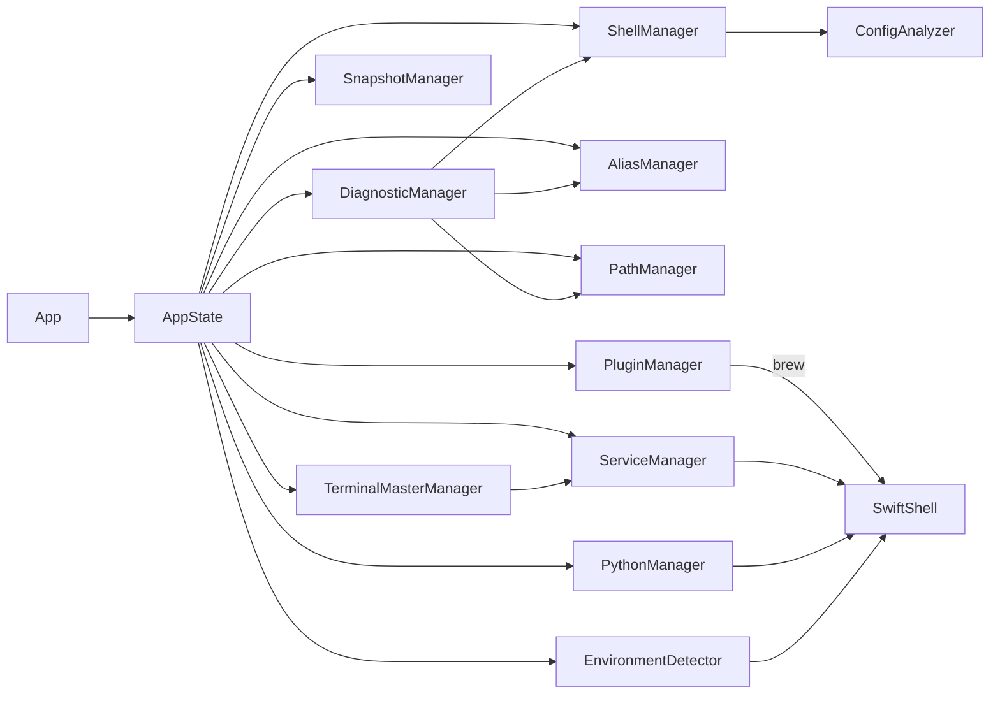

# 依赖关系

## 1. 外部依赖

SPM 配置见 [Package.swift](../../Package.swift)。

### 1.1 SwiftShell

- 仓库：https://github.com/kareman/SwiftShell
- 用途：
  - 执行 shell 命令（同步 `run` / 异步 `runAsync`）
  - 捕获 stdout/stderr 并在 UI 中实时展示（如安装器/插件安装/环境检测脚本）
- 主要使用点：
  - `ShellManager`：运行检查脚本、refresh shell
  - `AliasManager`/`PathManager`：读取会话状态（可选）
  - `EnvironmentDetector`：`which` + `--version`、运行脚本
  - `PluginManager`/`ServiceManager`/`PythonManager`/`TerminalMasterManager`：安装流程与输出流

## 2. 内部模块依赖图（概念）

## 3. 依赖矩阵（关键调用关系）

| 模块 | 依赖 | 目的 |
|---|---|---|
| App | AppState, LanguageManager | UI 装配与 i18n |
| AppState | 各 Manager | 全局实例与启动编排 |
| ShellManager | ConfigAnalyzer, SwiftShell, FileManager | 接管/解析/写回与刷新 |
| AliasManager | SwiftShell(可选), FileManager | 列表 CRUD、会话同步、落盘 |
| PathManager | SwiftShell, FileManager | PATH 管理、实时会话分析 |
| PluginManager | SwiftShell, FileManager | brew 安装/启用、编译输出 |
| ServiceManager | SwiftShell | 一键安装基础服务（输出流） |
| EnvironmentDetector | SwiftShell | which/版本探测、脚本报告 |
| PythonManager | SwiftShell | pyenv 版本管理 |
| DiagnosticManager | ShellManager, PathManager, AliasManager | 规则扫描与修复 |
| SnapshotManager | FileManager | 管理器配置快照回滚 |
| TerminalManager | Process | zsh -lc 执行命令、清洗输出 |
| TerminalMasterManager | ServiceManager, SwiftShell, FileManager | OMZ/P10k/字体/主题配置 |
| AIManager | URLSession, UserDefaults | AI 请求与设置存储 |

## 4. 重要的“隐式依赖”（运行时假设）

这类依赖不体现在 SPM dependencies 中，但会影响运行效果：

- 系统工具：`/bin/zsh`、`/bin/bash`、`/usr/bin/which`、`git`、`curl` 等。
- Homebrew：插件安装与部分服务安装以 brew 为核心（PluginManager 会尝试寻找 brew 的绝对路径）。
- 网络访问：一键安装与部分诊断能力依赖网络（curl/wget）。

