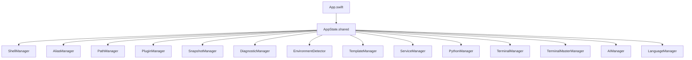

# 模块与关键 API

## 1. 模块总览

本项目的业务逻辑主要集中在一组 `*Manager.swift` 中，SwiftUI Views 负责渲染与触发这些 Manager 的动作。

## 2. 核心管理器（Managers）

### 2.1 AppState（全局容器/启动编排）

文件：[AppState.swift](../../Sources/ZshrcManager/AppState.swift)

- 职责：单例持有各 Manager 实例，并提供 `startAll()` 串行启动流程，避免启动时 shell 命令冲突。
- 关键点：将“启动顺序”固化为串行队列（`startupQueue`）。

### 2.2 ShellManager（接管/解析/迁移/写回）

文件：[ShellManager.swift](../../Sources/ZshrcManager/ShellManager.swift)

**核心数据结构**

- `ConfigLine`：按行表示配置文件内容，并带有：
  - `isCommented`：是否被注释
  - `isManagerInjected`：是否是管理器注入行（卸载时依赖）

**关键 API**

- `start()`：探测配置文件路径，加载行并计算 insights/conflicts。
- `install()`：创建 `~/.zsh_manager/main.zsh`（如缺失），并在主配置文件尾部注入 `source ~/.zsh_manager/main.zsh`。
- `uninstall()`：从主配置文件移除注入行。
- `loadConfigLines()`：读取配置文件并生成 `ConfigLine` 数组，调用 `ConfigAnalyzer` 做分析。
- `toggleLine(id:)` / `commentLine(at:)`：对行注释状态做修改并写回。
- `migrateAll()`：按分类把“可迁移行”写入模块文件，并注释掉原行；记录 `lastMigration` 以支持 `undoMigration()`。

**关键设计取舍**

- 不做语法树级别解析：按“行”管理，降低错误率，但牺牲对复杂结构（多行函数/条件块）的精确操作能力。
- “迁移”采用注释而非删除，降低不可逆风险。

### 2.3 ConfigAnalyzer（配置分析/冲突检测）

文件：[ConfigAnalyzer.swift](../../Sources/ZshrcManager/ConfigAnalyzer.swift)

- `analyze(lines:)`：对 alias/export/source/plugins 等关键词行做分类，输出 `ConfigInsight`。
- `detectConflicts(lines:)`：检测重复 export（排除 PATH）、重复 alias 等冲突，输出 `ConfigConflict`。

局限：

- 目前冲突检测规则偏轻量（按字符串前缀/`=` 切分），对复杂写法（多行、函数内 export、条件分支）识别能力有限。

### 2.4 AliasManager（Alias CRUD + 编译输出）

文件：[AliasManager.swift](../../Sources/ZshrcManager/AliasManager.swift)

- 数据：
  - `aliases: [AliasDefinition]`
  - 落盘：`~/.zsh_manager/aliases.json`（元数据），`~/.zsh_manager/aliases.zsh`（脚本）
- 关键 API：
  - `load()` / `save()`：JSON 与脚本双写
  - `addAlias(...)` / `updateAlias(...)` / `removeAlias(name:)`
  - `syncWithSession()`：从当前会话 `alias` 输出中吸收“系统检测到的 alias”（当前在 `start()` 中被注释掉，属于可选能力）

### 2.5 PathManager（PATH 列表管理 + 实时会话分析）

文件：[PathManager.swift](../../Sources/ZshrcManager/PathManager.swift)

- 数据：
  - `paths: [PathEntry]`：UI 管理的路径
  - `sessionPaths: [PathEntry]`：实时分析当前会话 PATH（来源/有效性/是否被覆盖）
- 关键 API：
  - `save()`：写 `paths.json` 并生成 `paths.zsh`（形式为 `export PATH="...:$PATH"`）
  - `refreshLivePath()`：从 `zsh -f -c "echo $PATH"` 获取 PATH 并标注 source（system/managed/user）与 shadowed 状态
  - `checkValidity()`：检查目录存在性（支持 `$HOME`/`~` 的部分展开）

注意：

- 目前对动态表达式（`$()`/反引号/`$VAR`）的有效性检查较保守（避免误判）。

### 2.6 PluginManager（插件预置、安装、启用与编译输出）

文件：[PluginManager.swift](../../Sources/ZshrcManager/PluginManager.swift)

- 预置插件：autosuggestions、syntax-highlighting、thefuck、zoxide、tldr、eza、bat、fzf-tab 等。
- 安装策略：
  - brew 安装为主（`brew install <brewName>`）
  - OMZ 内置插件通过 `plugins+=(...)` 激活
- 持久化：
  - `plugins.json`：仅保存启用状态映射（`[String: Bool]`）
  - `plugins.zsh`：按启用+已安装的插件输出 `initLine`

### 2.7 SnapshotManager（快照/回滚）

文件：[SnapshotManager.swift](../../Sources/ZshrcManager/SnapshotManager.swift)

- 快照位置：`~/.zsh_manager/snapshots/<timestamp>/...`
- 备份范围：`aliases.{zsh,json}`、`paths.{zsh,json}`、`env.{zsh,json}`、`main.zsh`
- 风险提示：当前快照不包含用户原 `.zshrc`，更偏“管理器配置回滚”，不是“全系统 dotfiles 回滚”。

### 2.8 DiagnosticManager（诊断规则 + 自动修复入口）

文件：[DiagnosticManager.swift](../../Sources/ZshrcManager/DiagnosticManager.swift)

- `runDiagnostics(...)`：串行执行多条规则并计算健康分。
- `applyFix(for:shellManager:)`：对部分规则自动注释对应行。

### 2.9 EnvironmentDetector（环境探测 + 全量脚本报告）

文件：[EnvironmentDetector.swift](../../Sources/ZshrcManager/EnvironmentDetector.swift)

- `scan()`：对 Homebrew/Python/Node/Go/Rust/Java/GCC/Flutter/Ruby/PHP 等做 `which` + 常见路径搜索，并读取 `--version`。
- `runFullCheckScript()`：执行 `scripts/check_env.sh` 并展示完整报告输出（支持 bundle 内脚本与开发态脚本路径）。

### 2.10 ServiceManager（“基础服务”一键安装）

文件：[ServiceManager.swift](../../Sources/ZshrcManager/ServiceManager.swift)

- 预置服务：brew、nvm、node、omz、rust、docker、pyenv、pnpm、bun、go、deno、gh、openjdk、iterm2、nerd-font 等。
- `checkAllStatus()`：用 `bash -c` 执行 `checkCommand` 进行探测。
- `install(service:)`：执行 `installCommand`，把 stdout/stderr 实时写入 UI 控制台。

商业化风险点：`installCommand` 内含远程脚本（curl | bash），需要“安全提示 + 可审计 + 最小权限”机制（见商业化评估）。

### 2.11 PythonManager（pyenv 版本管理）

文件：[PythonManager.swift](../../Sources/ZshrcManager/PythonManager.swift)

- 依赖：系统中已安装 `pyenv` 时启用更多能力。
- 功能：列出已安装版本、可安装版本（简化为最新 10 个）、安装版本、设置 global。
- 额外：支持指定 Pyenv 构建镜像源（华为云/阿里云）。

### 2.12 TerminalManager（终端实验室）

文件：[TerminalManager.swift](../../Sources/ZshrcManager/TerminalManager.swift)

- 通过 `Process` 运行 `/bin/zsh -lc <command>`，将 stdout/stderr 合并并移除 ANSI 控制码。
- 典型用途：在 UI 内“快速验证配置是否生效”，为诊断/向导提供命令执行能力。

### 2.13 TerminalMasterManager（终端美化一键起飞）

文件：[TerminalMasterManager.swift](../../Sources/ZshrcManager/TerminalMasterManager.swift)

- 检测：是否安装 OMZ / Powerlevel10k / 字体（MesloLGS）。
- 协调：`runBoostSequence(serviceManager:)` 依赖 `ServiceManager` 先安装 iTerm2 → OMZ → 字体，再安装/应用 P10k。
- 注意：会直接修改 `~/.zshrc` 的 `ZSH_THEME`，并插入 P10k instant prompt 片段（属于“侵入式改动”，商业版需要强化可回滚与差异化提示）。

### 2.14 TemplateManager（预置模板）

文件：[TemplateManager.swift](../../Sources/ZshrcManager/TemplateManager.swift)

- 预置模板：Node(NVM)、Python(Pyenv)、Claude Code、OpenClaw、Gemini CLI、Java、Go、Flutter、Ruby 等。
- 模板内容可能包含：
  - aliases
  - paths
  - initScripts（写入 `env.zsh` 的片段）
  - requiredKey（如 `ANTHROPIC_API_KEY`）

### 2.15 AIManager（AI 命令生成）

文件：[AIManager.swift](../../Sources/ZshrcManager/AIManager.swift)

- 支持 Provider：
  - Gemini（通过 API Key 拼接 URL）
  - OpenAI/兼容（Authorization Bearer）
- 存储：使用 `UserDefaults` 保存 API Key / Endpoint / Provider。
- UI：`AICommandGeneratorSheet` 与 `AISettingsView`（见 `Views/`）。

安全提示：

- API Key 目前是明文保存于 `UserDefaults`（macOS 上通常是 plist），并非系统钥匙串。商业化建议迁移至 Keychain，并对请求/日志做脱敏。

## 3. UI 页面（Views）

页面基本是“展示 + 调用 Manager API”。入口导航位于 [App.swift](../../Sources/ZshrcManager/App.swift)：

- Overview：ShellManager 接管状态与健康分
- Aliases：AliasManager
- Path：PathManager
- Environment：EnvironmentDetector
- Python：PythonManager
- Doctor：DiagnosticManager（结合 ShellManager/PathManager/AliasManager）
- Snapshots：SnapshotManager
- Plugins：PluginManager
- TerminalMaster：TerminalMasterManager + ServiceManager
- Functional：ShellManager 的 insights/conflicts/迁移相关视图

